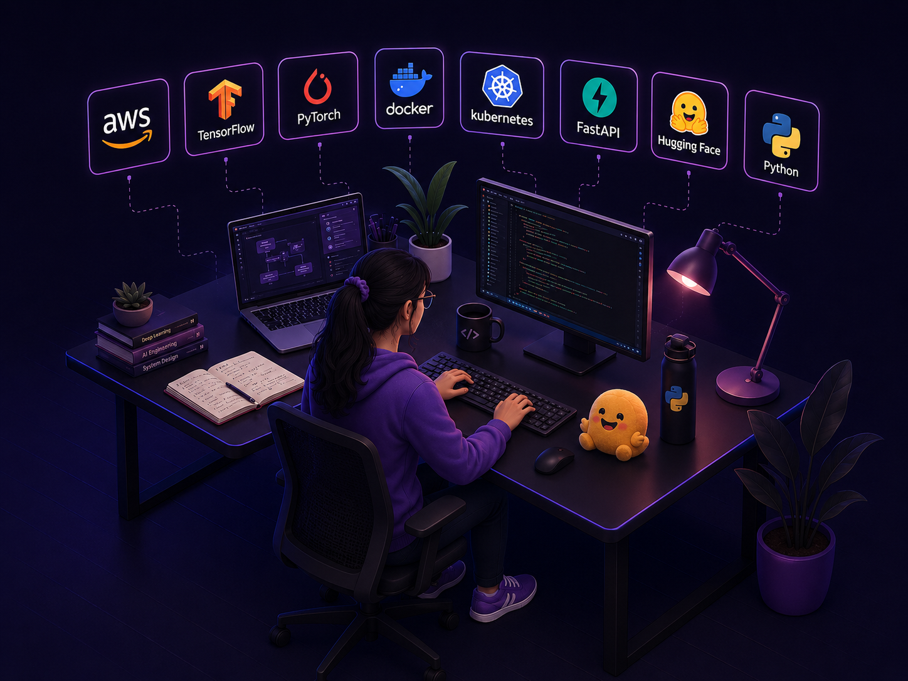
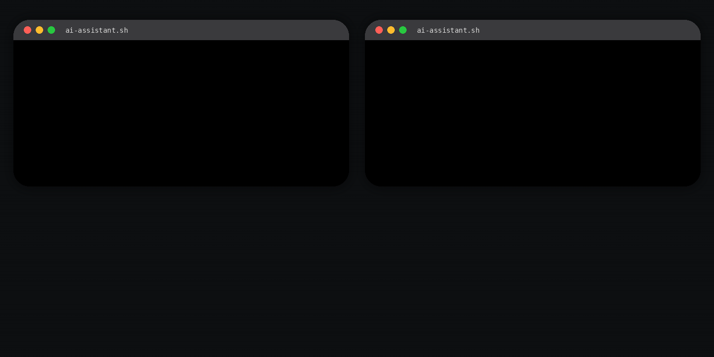

<!-- TOP WAVE HEADER -->

  

  

  

  

<h2 align="left" id="featured-projects">Featured Projects</h2>

<table>
  <tr>
    <td width="50%" valign="top">
      <h3>Surface Defect Detection</h3>
      
<strong>Production CV inspection for manufacturing at scale</strong>

      
Hybrid supervised classification plus anomaly safety gating with ONNX Runtime serving, FastAPI deployment, drift monitoring, and production-safe threshold calibration.

      
<strong>Impact</strong> 
      <code>+15% F1</code> <code>+36.8% recall</code> <code>85% escaped-defect reduction</code> <code>59% latency reduction</code>

      

        
        
        
        
      

      
<a href="https://github.com/AnoushkaBaidya/surface-defect-detection">View Repo</a>

    </td>
    <td width="50%" valign="top">
      <h3>LLMOps Intent Platform</h3>
      
<strong>Structured LLM fine-tuning, serving, and deployment pipeline</strong>

      
QLoRA fine-tuning on Banking77 with MLflow experiment tracking, structured JSON inference, FastAPI serving, containerization, and production-style monitoring.

      
<strong>Impact</strong> 
      <code>+31.8pp accuracy</code> <code>100% schema compliance</code> <code>0 parse failures</code>

      

        
        
        
        
      

      
<a href="https://github.com/AnoushkaBaidya/llmops-structured-intent-platform">View Repo</a>

    </td>
  </tr>
  <tr>
    <td width="50%" valign="top">
      <h3>DocInsight</h3>
      
<strong>RAG PDF QA benchmarked against 500 golden questions</strong>

      
Dense retrieval plus BM25 plus Reciprocal Rank Fusion with FAISS indexing, page-level citations, benchmark reports, and local-first QA workflows.

      
<strong>Impact</strong> 
      <code>+33.8% Recall@1</code> <code>93ms p95 latency</code> <code>500 eval questions</code>

      

        
        
        
        
      

      
<a href="https://github.com/AnoushkaBaidya/DocInsight">View Repo</a>

    </td>
    <td width="50%" valign="top">
      <h3>ML Portfolio App</h3>
      
<strong>Interactive portfolio for production ML projects</strong>

      
Streamlit portfolio that packages architecture walkthroughs, deployment stories, model evaluation results, dashboards, and benchmark snapshots into one demo surface.

      
<strong>Focus</strong> 
      <code>Production ML</code> <code>Computer Vision</code> <code>MLOps</code> <code>RAG</code> <code>LLMOps</code>

      

        
        
      

      
<a href="https://github.com/AnoushkaBaidya/ml-portfolio-streamlit">View Repo</a>

    </td>
  </tr>
</table>

<h2 align="left" id="tech-stack">Tech Stack</h2>

<table>
  <tr>
    <td width="25%" align="center">
      <strong>ML and Deep Learning</strong>  
      
        
      
      
    </td>
    <td width="25%" align="center">
      <strong>MLOps and Serving</strong>  
      
        
      
      
      
    </td>
    <td width="25%" align="center">
      <strong>Cloud and Infrastructure</strong>  
      
    </td>
    <td width="25%" align="center">
      <strong>Engineering Workflow</strong>  
      
        
      
      
    </td>
  </tr>
</table>

<h2 align="left" id="github-stats">GitHub Stats</h2>

<table width="100%">
  <tr>
    <td width="50%" align="center" valign="top">
      
    </td>
    <td width="50%" align="center" valign="top">
      
    </td>
  </tr>
</table>

  

<h2 align="left" id="contribution-snake">Contribution Snake</h2>

<picture>
  <source media="(prefers-color-scheme: dark)" srcset="https://raw.githubusercontent.com/AnoushkaBaidya/AnoushkaBaidya/output/github-snake-dark.svg"/>
  <source media="(prefers-color-scheme: light)" srcset="https://raw.githubusercontent.com/AnoushkaBaidya/AnoushkaBaidya/output/github-snake.svg"/>
  
</picture>

  <strong>Building reliable ML systems that perform in production, not just in notebooks.</strong>

